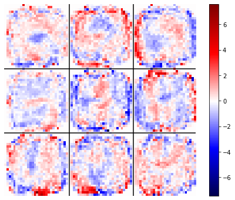

# Neural Network and Deep Learning projects

This repository contains all the projects developed during the homonym course of my master degree [Physics of Data](https://www.unipd.it/en/educational-offer/master-s-degrees/school-of-science?tipo=LM&scuola=SC&ordinamento=2018&key=SC2443&next=true).
All assigned projects are descripted and explained in each "LabXX_Vidaich_report.pdf" file.

## Lab 01: Introduction
This contains the notebooks of the first Lab lesson, where the basic concepts of python where explored with some examples, also regarding simple technics to train a model. 

No project were assignated to this lab, so the code was let untouched.

## Lab 02: Implementation of a NN with NumPy
The goal of this work was to build a Neural Network from scratch using NumPy to solve a regression problem. No dedicated framework (like pytorch, tensorflow, etc.) was allowed. 

After preparing the Network class and its training method, the functions for Grid Search and for K-fold Cross validation (called during every iteration of the first one) were built in order to perform an exhaustive research of the best Hyper-Parameters values.
The resulting model is shown in the figure below.

	

## Lab 03: Classification of MNIST
The goal of this work was to build a feed-forward neural network to solve a multi-classification problem over the MNIST dataset with PyTorch.

In order to find the best values for the Hyper-parameters, the `sklearn` library was used to preform a Random Search. In particular, the library `skorch` was introduced to make PyTorch networks compatible with the `sklearn` interface.

Moreover, the features encoded in the trained network were studied using two different methods:
  * Neurons' Receptive field visualization
  * Gradient ascent over each neuron's activation
  
For example, we report here the receptive field of the output layer (without the neuron corresponding to the label "9"):

	

## Lab 04: Music generation with Recurrent NNs
This project is based on a Recurrent Neural Network, trained with the [piano-midi](http://www.piano-midi.de/) dataset to generate music given an initial sequence.
<!--The dataset was pre-processed to reduce the complexity of the music samples, and then it was augmented by transposing it along the "notes" axis (same music in different keys).-->

The main component of the model is a LSTM layer, but the whole architecture is splitted to generate separately the notes played by the right and the left hand. This is possible only because the samples in the dataset are also composed by those two separated tracks.

	

The output of the network for each hand is given by a probability distribution over the notes that should be played in the timestep following the analyzed sequence and by the number of notes that should be sampled from it. 

By not forcing the model to choose among some prepared chords, its expressive power was greatly enhanced. An example of a generated sample is reported here. 

	

## Lab 05: Autoencoders for MNIST reconstruction
The goal of this work was to build an Autoencoder to reconstruct digits of the MNIST dataset. 

The model performance was also tested against corrupted data obtained by adding noise or by obscuring a portion of the image. A denoising model was also developed, but the original already performed really well (see example below).

	

	

The generative capabilities of these models were also explored. In particular, the trained autoencoder was regular enough to allow smooth sampling. This means that a point moving in its encoded space produces a continous evolution of the output. 

In the following examples are shown some morphing digits obtained by starting in a centroid of a digit in the encoded space and moving toward another one (starting from left: 2→0, 3→9, 1→4).

<table><tr>
<td>  </td>
<td>  </td>
<td>  </td>
</tr></table>

## Lab 06: Reinforcement Learning
This assignment focuses on understanding the basic concepts of Reinforcement Learning. Testing On-policy and Off-policy algorithms with different policies and eps-decay profiles, we explored problems where an agent has to reach a goal position in a 10x10 empty grid or in a maze under different conditions.

	

